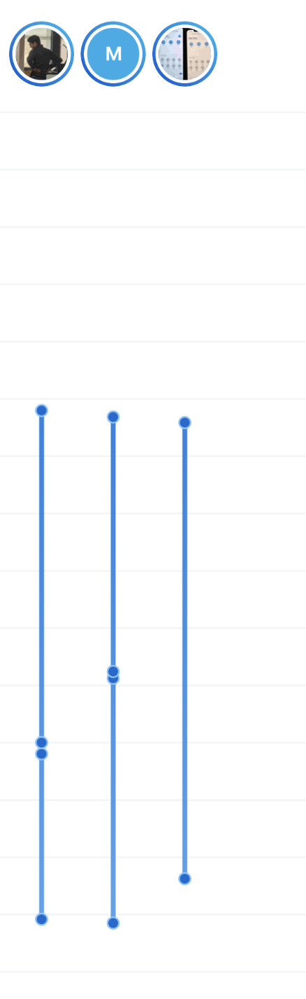

# Ubiety - Frontend Code Test

## Overview  

This code test is designed to give us insight into your coding abilities and how you approach solving problems. We want to see how you think through challenges and how your knowledge aligns with the skills outlined in our job description and the conversations we've had. We expect a working solution but encourage you not to spend more than a couple of hours on this task.

At Ubiety, we value individual contributions as much as teamwork. Communication and documentation are key to our success. We understand that developing a solution under a time constraint requires making trade-offs, so feel free to include any context around your decisions, assumptions, challenges, and solutions. This will help us better understand your approach and thinking.

You’ll be leading the implementation of product features, advocating for API design, and building reliable, easy-to-use software solutions that power Ubiety’s innovative products.

## The Challenge: Visualizing Presence Timelines

The task is to create a visualization of presence timelines from two sets of data. We’ve included a sample visualization to give you an idea of the format we’re expecting.



You’ll work with two JSON datasets:  

- **presence.json**: Contains profile presence information, with the profile ID as the key.
- **profiles.json**: Contains user profile details.

### Presence Data Details

- The intervals are represented as [start, end]. `start` is the ENTER time, and `end` is the EXIT time.
- If a profile is absent, the last interval will be [start, end], with the current `start` as ENTER and `end` as EXIT.
- If a profile is present, the last interval will be [start, end], where `start` is ENTER and `end` is the current timestamp, indicating the profile is still present.

## Key Considerations

We’re not just looking for the shortest solution but for thoughtful design and decision-making. As a leader, you will help define product features, advocate for API designs, and build scalable, stable solutions that power Ubiety’s latest products. This requires balancing resources, time, and scope to deliver a meaningful impact for our business and our customers.

Please consider the following:

- **Code quality**: Is it readable, maintainable, and understandable?
- **Testing**: How have you ensured your code works reliably?
- **Design**: Is the solution user-friendly and intuitive?
- **Extensibility**: Can the solution be easily extended for future needs?
- **Simplicity**: Is the solution as simple as it needs to be, without unnecessary complexity?

At Ubiety, we believe that perfection can sometimes slow progress. We’re looking for a solid first iteration that’s visually appealing and functional, giving the end customer a clear understanding of the dataset.

## Submission Guidelines

Please submit your solution as a zip file or a link to a public code repository. If submitting via a zip file, remove any large or unnecessary files to keep it compact. We use React and React Native in our tech stack and predominantly TypeScript in our existing codebases.

If you use additional libraries or frameworks, please include clear instructions on how to install and set them up, ideally using common tools and practices.

You’re welcome to use frameworks or tools (like Create React App, MUI, Ant, etc.) to help structure your app, but it’s not required, and you won’t be penalized for not using them.

Additionally, providing documentation about your implementation, decisions, challenges, and assumptions will be incredibly helpful. Documentation is vital for collaboration, especially in a hybrid work environment.

Ubiety thrives on open and honest communication. If anything comes up that could affect your delivery timeline, let us know early. We have left some ambiguity in the instructions and data supplied, this is to determine how you overcome these obstacles. We value transparency and teamwork.

Good luck!

This is a [Next.js](https://nextjs.org) project bootstrapped with [`create-next-app`](https://nextjs.org/docs/app/api-reference/cli/create-next-app).

## Getting Started

First, install the necessary packages

```bash
npm i
```

Then, run the development server:

```bash
npm run dev
```

Open [http://localhost:3000](http://localhost:3000) (port number may vary) with your browser to see the result.

You can start editing the page by modifying `app/page.tsx`. The page auto-updates as you edit the file.

This project uses [`next/font`](https://nextjs.org/docs/app/building-your-application/optimizing/fonts) to automatically optimize and load [Geist](https://vercel.com/font), a new font family for Vercel.

## Learn More

To learn more about Next.js, take a look at the following resources:

- [Next.js Documentation](https://nextjs.org/docs) - learn about Next.js features and API.
- [Learn Next.js](https://nextjs.org/learn) - an interactive Next.js tutorial.

You can check out [the Next.js GitHub repository](https://github.com/vercel/next.js) - your feedback and contributions are welcome!

## Deploy on Vercel

The easiest way to deploy your Next.js app is to use the [Vercel Platform](https://vercel.com/new?utm_medium=default-template&filter=next.js&utm_source=create-next-app&utm_campaign=create-next-app-readme) from the creators of Next.js.

Check out our [Next.js deployment documentation](https://nextjs.org/docs/app/building-your-application/deploying) for more details.

---------------

## Discussion

- Initial approach was to use a charting library
- Tried both highcharts and recharts but was running into roadblocks getting the profile icons to style correctly
- Pivoted to a custom built solution where the lines and intervals would be "manually" drawn
